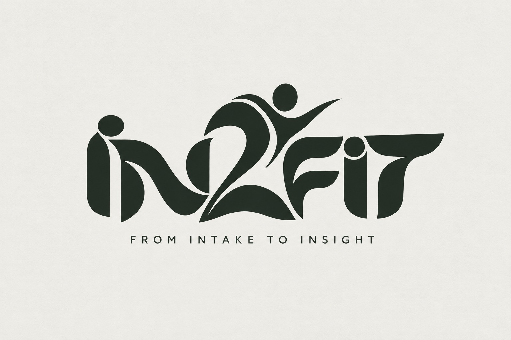
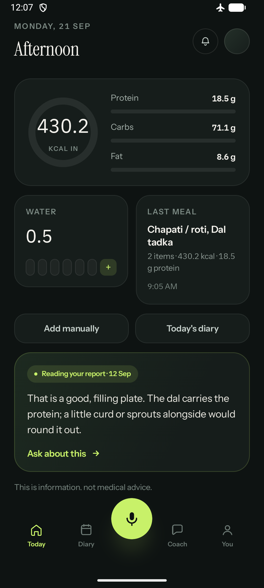
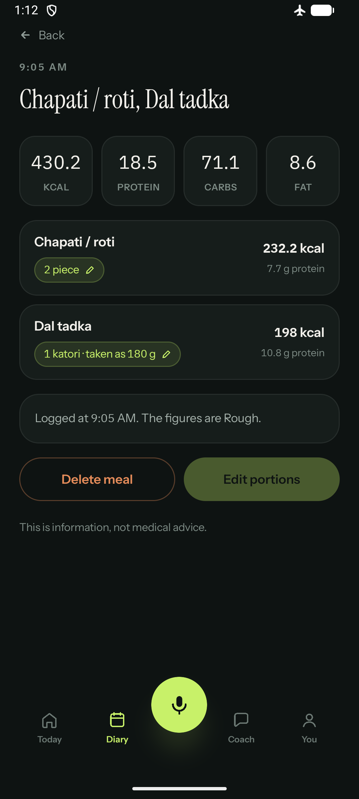
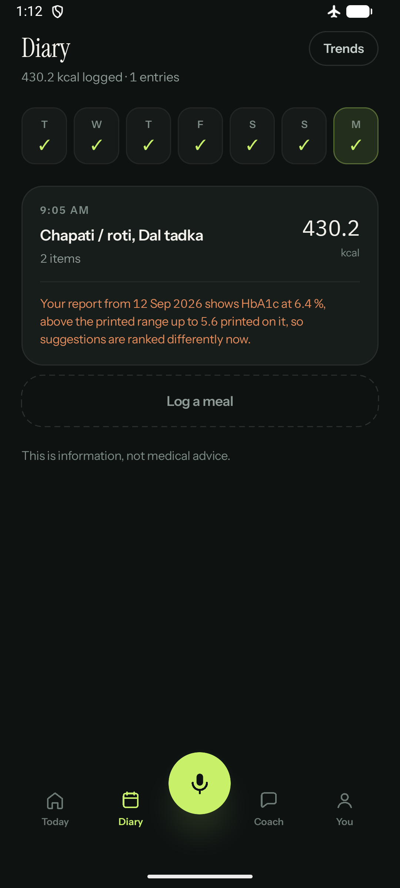
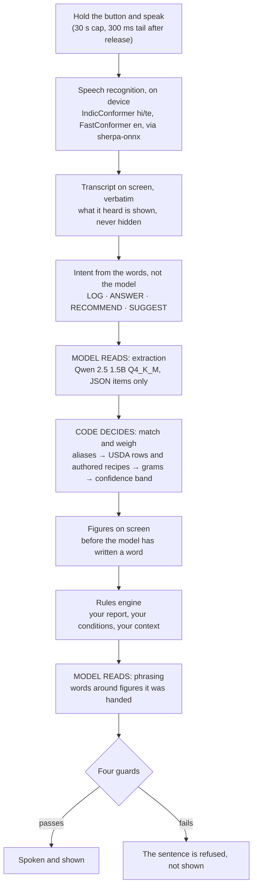

  

<h1 align="center">IN2FIT</h1>

  An Android health assistant that hears what you ate, reads your lab report, and works out what to say — entirely on the phone, with no internet permission in the build.

  
  
  
  
  

  <a href="https://youtu.be/IESWo7uO6aI"><b>Watch the demo</b></a>

---

## The problem

A calorie app knows what you ate and knows nothing about your blood. Your lab report knows your
ferritin is low and sits in a drawer, or in a PDF you never open again, and nothing you eat
changes because of it. And nobody eats in grams: you ate *thodi dal*, a little dal, out of a
katori whose size is your household's and nobody else's — and an app that turns that into a
confident number has invented it.

## What it does

1. **You say what you ate, in the language you choose** — Hindi, English or Telugu — and it
   writes down the foods, the amounts, and how far each figure can be trusted.
2. **You photograph a printed lab report** and it reads the values with the ranges the sheet
   itself prints beside them; it never carries ranges of its own.
3. **The advice changes because of the report.** The same plate, logged before and after, is
   answered differently, and the sentence that explains why is a template the rules engine
   chose, not prose a model wrote.
4. **None of it leaves the phone.** The demo build asks for two permissions, microphone and
   camera, and has no `INTERNET` permission at all; the build fails if a dependency adds one.

## What it looks like

| Today | A logged meal | The diary, once a report is on file |
| --- | --- | --- |
|  |  |  |

The real app on an emulator, in airplane mode, over a seeded diary — not mockups, and not the
scripted feed, which the app watermarks on the device whenever it is on. The middle screen is
the whole argument in one line: *1 katori · taken as 180 g*, because nobody said how much dal,
and *the figures are Rough* under it. The orange sentence on the right is the rules engine's own
template, filled from values read off a printed report. More, including the hostile-read passes
over long text and Devanagari, in [`docs/screenshots/`](docs/screenshots/).

A recorded run of the four demo beats: [the demo video](https://youtu.be/IESWo7uO6aI).

## How it works

The one sentence the architecture is built around: **the model reads, the code decides.**

A language model is good at turning "मैंने दो रोटी और थोड़ी दाल खाई" into a list of foods, and good
at putting words around a figure. It is catastrophic at arithmetic you intend to act on. So the
model never computes and never holds a number: it names foods, and it phrases sentences around
figures that were handed to it finished.

### The four guards

Each one is a file, and each exists because something got through without it.

| guard | what it refuses |
| --- | --- |
| [`DefaultNumericGuard`](app/src/main/java/io/github/vedant7007/katori/ml/llm/DefaultNumericGuard.kt) | any number in the model's output that was not in the model's input. "That's roughly 450 calories" is a fabricated health figure wearing the app's voice |
| [`ClaimGuard`](app/src/main/java/io/github/vedant7007/katori/ml/llm/ClaimGuard.kt) | a nutrition claim restated in the model's own words. It was added the day the model fused a true knowledge row onto the wrong food and passed every other check |
| [`SafetyLine`](app/src/main/java/io/github/vedant7007/katori/ml/llm/SafetyLine.kt) | a diagnosis, a prescription or a clinical verdict, on both sides of the model; a serious matter gets a doctor referral **alongside** the help, never instead of it |
| [`Confidence`](app/src/main/java/io/github/vedant7007/katori/domain/model/Confidence.kt) | presenting an amount nobody stated as though someone had. "थोड़ी दाल" states no amount, so the plate reads *1 katori · taken as 180 g*, banded Rough, and that figure is the one a person corrects |

Two more rules hold the same line lower down: a missing nutrient is **Unknown**, never zero
(collapsing B12 to zero for a vegetarian is the most consequential bug available to this
project), and a stub returns *not implemented* rather than a plausible value.

## What is measured, and on what

Every figure below names the handset and the file it came from. Where a number exists only for
the realme, it says realme. Nothing here was measured on the loaner iQOO, which is handed to
teams on the day of the event.

| what | figure | where it came from |
| --- | --- | --- |
| Speech, the ten demo sentences in Vedant's own voice, Hindi | foods heard **16 of 16**; 3 of the ten exact | `logs/asr-eval-vedant-demo.log`, decode on a laptop of recordings made in the room |
| The same ten in Indian English | foods heard **7 of 16** | the same file. This is why the demo is in Hindi (`docs/decisions/0031`) |
| Speech on the phone, synthetic clips | en 339 ms per clip at 4 threads; te 1,279 ms with the phone hot | realme RMX3780, `AsrDeviceTest.b`, `docs/decisions/0021` |
| A late thumb on the microphone button | costs nothing up to a second; a cut 300 ms **inside** the last word loses the sentence, 0 of ten | `logs/asr-tail-after-last-word.log` |
| The plate for two rotis and one katori dal | 467.2 kcal, 20.9 g protein, every line Approximate | computed by `DeckClaimsTest` from the shipped database on every run, into `logs/deck-plate.md` |
| Your own diary figures on screen when you ask a question, before the model starts | ~0.5 s | realme, `logs/e2e-demo-condition-20sep.txt` |
| The demo APK | 69,635,265 bytes | `logs/apk-size.log`, the ledger every build appends to; that row is commit `9d7c025` with local changes, which the ledger records as `-dirty` |
| The shipped food database | 92 foods, 621 aliases, 65 recipes, 41 items deliberately recorded as having no data | `app/src/main/assets/food/katori-food.db`, built by `tools/build_food_db.py`, which deletes the database it just wrote if any import assertion fails |

**One caveat that swallows several timings.** On 22 September the integrator measured why some
runs were minutes long: whenever the app is not the focused window — behind the lock screen, the
notification shade, any other app — Android moves the process to the little cores, and eight
inference threads there collapse. A two-token prompt took 14,864 ms in the background against
348 ms in front. Every end-to-end latency taken through the instrumentation rig may be a
little-core number, so the end-to-end figures are being taken again with the phone unlocked and
the app in front. The per-stage numbers above are not affected.

## What is not built, or not proven

The honest list. "Unproven" here means the code is on `master` and has never run on a phone.

- **The photograph half of the lab report.** The parse is solid and tested: values and the
  ranges printed beside them are read, and both out-of-range values fire their trigger. But
  the camera step — ML Kit reading a printed sheet — has **one** observation on hardware ever,
  a single haemoglobin row. A fixture set is being built. This is a live demo step.
- **Beat 1 through the microphone.** The frozen Hindi sentence extracts and resolves correctly
  on the phone when it is typed in — the first Hindi plate on a device, 22 September — but the
  two attempts through the microphone that day came back with mangled transcripts while the
  phone was being handled. Not yet passed.
- **Every Telugu string in the app is machine-generated and unreviewed.** They are marked as
  such beside every key and stay marked until a fluent speaker signs the packet off
  ([`docs/localisation/`](docs/localisation/)). Nobody on the team reads Telugu.
- **The model staging script** (`tools/stage-models.ps1`, 1.6 GB in chunks over a link that
  drops) has never been run on a phone.
- **One test is red.** A full run on 22 September was **472 tests, one failure**:
  `DevanagariTest > every one of the nine resolves through the real matcher, chutney pending its
  alias`. It is a test that has outlived its own premise — it asserts चटनी is still missing an
  alias, and the alias now resolves — so the fix is to the test, and its failure message names
  the person who owns it. Red tests are tracked in `COORDINATION.md`, never left unexplained.
- Exercise form checking, activity and sensor input, and packaged-label scanning are designed
  and not built.

## Build and run

Windows, the Android Studio SDK, JDK 21. Every script writes to `logs/`, and those logs are the
evidence behind every number above.

    tools\1-setup-toolchain.bat      NDK and CMake into the SDK
    tools\2-bootstrap-gradle.bat     the Gradle wrapper
    tools\4-fetch-models.bat         model weights, the speech runtime, phoneme data; every sha256 checked
    tools\5-build-llama-android.bat  cross-compiles llama.cpp for arm64 (dotprod, fp16)
    tools\3-build.bat                assembleDemoDebug, the unit tests, the APK size ledger

**On a fresh clone the order is 1, 2, 4, 5, 3.** The model weights (about 1.6 GB), the
sherpa-onnx AAR (39 MB, not published to Maven Central) and the llama.cpp libraries are not in
the repository, and the build refuses to start without them rather than producing an APK that
fails at runtime. Every download is checked against a recorded sha256, and a mismatch deletes
the file and exits non-zero rather than carrying on.

Two flavours:

- `assembleDemoDebug` — **the demo build.** The permissions are an allowlist checked against
  the *merged* manifest at every build, so a dependency cannot smuggle `INTERNET` in. Two are
  the app's own, `RECORD_AUDIO` and `CAMERA`; the third on the list is added by the platform
  itself for runtime-registered receivers and cannot be granted by anyone. It carries no
  scripted feed.
- `assembleFullDebug` — the same app with the scripted demo feed available for screenshots. Any
  screen it produces is watermarked on the device.

**The first launch is not instant.** The models live on the phone's storage, not in the APK
(`tools/stage-models.ps1` puts them there), the language model is about 1.1 GB on disk and
roughly 1.9 GB resident, and the app warms it at launch. If a model is missing the app says so
plainly — *"The model is not loaded on this phone yet"* — rather than pretending.

## Repository layout

| path | what is in it |
| --- | --- |
| `app/src/main/java/.../domain/` | the deterministic core: the orchestrator, the rules engine, confidence, the contracts. No Android, no model |
| `app/src/main/java/.../data/food/` | the bundled USDA layer: matching, recipes, the resolver that turns "one katori dal" into grams |
| `app/src/main/java/.../ml/` | speech (`asr`), the language model (`llm`), speech output (`tts`), the camera (`vision`) |
| `app/src/main/java/.../ui/` | Compose screens; every visible string is a key, enforced by a test |
| `app/src/main/cpp/` | the JNI shim over llama.cpp |
| `app/src/main/assets/` | the food database, the knowledge rows, and espeak-ng's phoneme data |
| `data-authoring/` | the hand-authored CSVs the food database is built from, and the rules for authoring them |
| `docs/` | the specification, the decision records, the licences, the demo plan — [`docs/README.md`](docs/README.md) is the index |
| `tools/` | every script, numbered in the order a stranger runs them — [`tools/README.md`](tools/README.md) |
| `HANDOVER.md` | the full audit: every file, every rule, and the bug behind each one |
| `COORDINATION.md` | the working log, written as the build happened |

## Data, and why the numbers are American

Every nutrient figure comes from **USDA FoodData Central**: public domain, CC0 1.0, SR Legacy
2018-04 with a Foundation Foods overlay. The attribution the database carries in its own
metadata is *U.S. Department of Agriculture, Agricultural Research Service. FoodData Central.
fdc.nal.usda.gov*.

India has its own food composition tables, and for Indian food they are the better source.
**IFCT 2017 and INDB are not used here in any form, not even as a reference to check a value
against**, because their licences do not permit it (`docs/decisions/0002`). Branded Foods was excluded too: 2.9 GB, no Indian products, and
third-party marks that would muddy a clean public-domain story.

That leaves a real gap — USDA has no dal tadka and no paneer — and the answer to it is the
**authored recipe layer**: 65 recipes written by hand against USDA ingredients, each citing the
reasoning for its amounts, each carrying its own serving weight so that "one katori dal"
resolves to a figure with a reason behind it. A fried dish records the fat it **retains**, not
the volume of the frying bath, and the importer asserts it: counting the bath is how a public
recipe database came to report 745 kcal per 100 g for a vada. Items with no honest source at all (ragi, bajra, jaggery and others) are recorded as
**no-data items** and resolve to no food rather than to a wrong one.

The app states the limit on screen: the figures are estimates from foods sampled in the United
States, not measurements of your own cooking.

Third-party licences are filed verbatim in [`docs/licences/`](docs/licences/), with the
reasoning in [`docs/decisions/0005`](docs/decisions/0005-model-sourcing-and-licences.md):
Qwen 2.5 (Apache-2.0), IndicConformer (MIT), NVIDIA FastConformer (CC-BY-4.0), Piper voices
(CC-BY-4.0), IBM Plex and the Instrument faces (OFL-1.1), and espeak-ng, which is
**GPL-3.0-or-later** and whose duties are written out in full before any APK is handed to
anyone.

## The team

- **Vedant Manmath Idlgave**, system and orchestration
- **Abhinav**, engineering and testing
- **Thanishka**, design and UI/UX

## Licence and naming

Licensed under Apache-2.0 ([`LICENSE`](LICENSE)). Built for the iQOO Hackathon 2026.

The working name was Katori. It survives in the package (`io.github.vedant7007.katori`), in
class and file names, and in the older records, because the native symbol names encode the
package and that rename is deferred (`docs/decisions/0015`). Everything a person sees on the
phone says IN2FIT.

This repository was written by one person, Vedant Manmath Idlgave, who authored every commit.
The working records — COORDINATION.md, the decision records under docs/decisions, and some
source comments — are written in named voices: Rao, Nila, Priya, Jacob, Meera, Arjun and Ira.
Those are labels for separate AI assistant sessions used as tooling during the build, not
people. They are kept because they are the record of how each decision was made, what was
measured, and what was found to be wrong and corrected.
