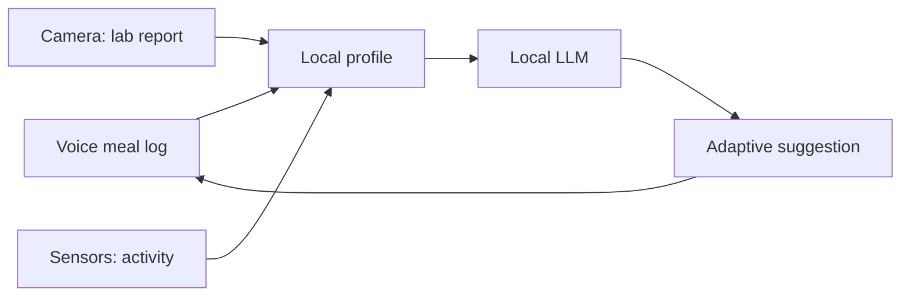
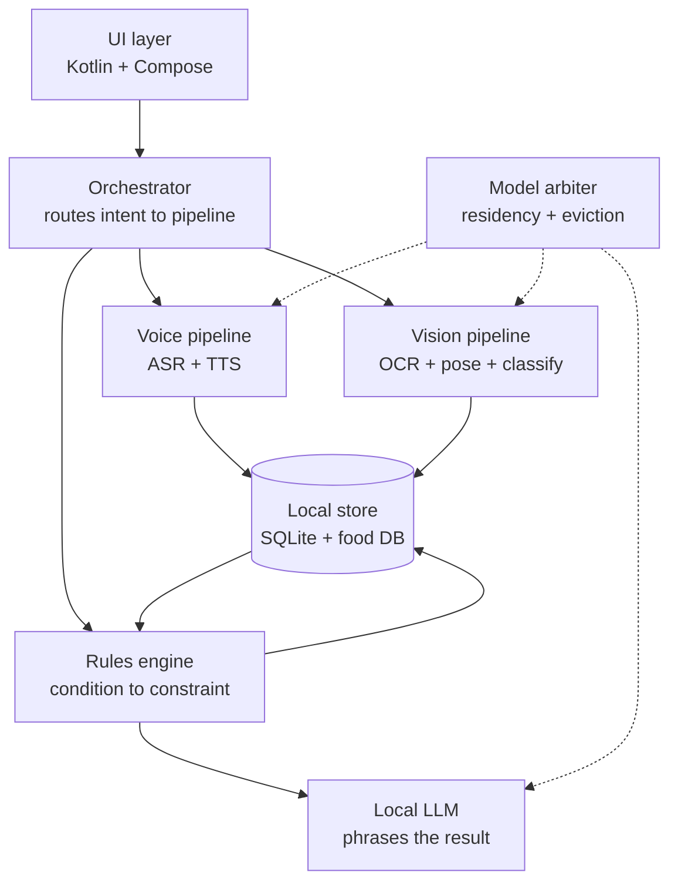
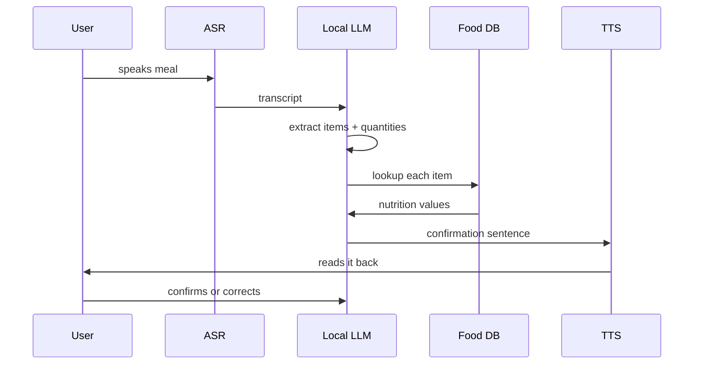
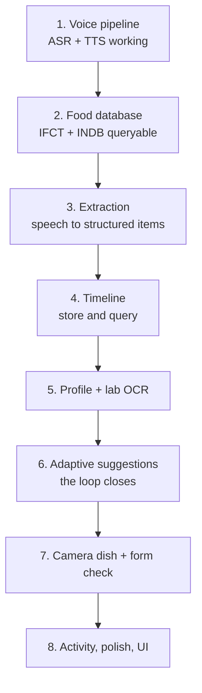

# Swasth (working name) — Full Project Specification

> **The product is now called IN2FIT.** This document is the original specification and says "Swasth" throughout; that name is historical and the body is left exactly as written. The source tree, the package `io.github.vedant7007.katori` and the decision records in `docs/decisions/` use a third name, KATORI, and are deliberately not renamed — see `0001`. Section numbers cited from code (`spec 11.5`, `spec 13.5`, and so on) refer to this file.

2026-09-18 · @Someone

iQOO Hackathon 2026 City Battles · Hyderabad · Team iQOOked · Student bucket

## 1. What this is

Swasth is a fully offline health and nutrition assistant that runs entirely on the phone. The user logs meals by speaking naturally in Telugu, Hindi or English. The app resolves that speech into nutrition figures using India's own food composition data, keeps a history the user can query by voice, reads lab reports through the camera, and checks exercise form through the camera.

Because one local model sees food, activity and clinical data together, the advice adapts to the person. Scan a report showing high blood sugar and the guidance on the same meal changes immediately. No combination of existing apps does this, because none of them share data with each other. No cloud app should, because this is the most private data a person owns.

**One-line pitch:** an offline health assistant that understands what you eat, what your body is doing, and what your reports say, all on one device and all at once.

**Pitch opener:** every health app knows one piece of you. Your calorie tracker does not know your blood report. Your fitness band does not know what you ate. Swasth knows all of it, and it never sends any of it anywhere.

**Working name.** Swasth is a placeholder. Alternatives on the table: Aarogya, Nabz, Pulse, Sehat. Settle this before the PPT and the video are produced, then use it everywhere. A named product reads as a product; an unnamed one reads as a college project.

## 2. The problem

Two separate failures, and the product must answer both.

### 2.1 Health data is fragmented across apps that cannot see each other

A person tracking their health today runs a calorie app, a fitness band app, and a folder of PDF lab reports. None of the three share data. The calorie app does not know the user's HbA1c. The band does not know they ate 900 calories of biryani. The lab report sits unread because it is written in clinical shorthand.

The consequence is that no tool can give advice that is actually specific to the person. Every suggestion is generic, because every tool holds only a fragment.

This cannot be solved by a cloud app either. Merging food logs, body metrics and clinical results into one cloud account is exactly the data concentration people refuse. The merge has to happen where the data already lives, which is the phone.

### 2.2 Photo-based calorie estimation is unreliable, and worst on Indian food

This matters because the camera is the obvious first instinct for a nutrition app, and it is the wrong foundation.

| Finding | Figure | Source |
| --- | --- | --- |
| Photo apps underestimate calories and fat | \~1/3 too low across four apps | [NUTRITION 2026 study](https://www.eurekalert.org/news-releases/1136415) |
| Accuracy on single-item plates | ±15–30% | [Calorie Rankings analysis](https://calorierankings.com/blog/can-ai-accurately-count-calories-from-photos/) |
| Accuracy on composed plates with hidden ingredients | ±25–40% | [Calorie Rankings analysis](https://calorierankings.com/blog/can-ai-accurately-count-calories-from-photos/) |
| Portion estimation error range | 10–30% depending on category | [PlateLens analysis](https://platelens.app/blog/ai-calorie-counter-accuracy) |

Portion estimation is the hardest step, because the model must infer a three-dimensional quantity from a two-dimensional image using plate size and camera angle as cues. Errors at each stage compound, which is why two apps can return numbers 30% apart on the same plate.

Indian food is composed plates with hidden ingredients, every single meal. The oil, the ghee, the tempering and the depth of a katori are all invisible to a camera. Published figures for one bowl of sambar range from 122 to 273 calories depending on the recipe. No camera resolves that gap. A person saying what they put in it does.

### 2.3 What this means for the design

The camera cannot be the primary input for nutrition. Voice must be, with the camera demoted to a first guess that voice corrects. This is stated up front because it inverts what most teams would build, and because it turns the category's known weakness into this project's design thesis.

## 3. The core thesis

Do not pitch this as "everything in one app". Judges hear that as a feature list and score it as scope creep.

Pitch it as this: **separate apps cannot see each other's data, so none of them can adapt to you. One local model that sees all three streams is the only thing that can close the loop, and it can only exist on-device.**

### 3.1 The closed loop



Each input writes to one local profile. The model reads the whole profile, not one stream. A change anywhere changes the output everywhere. That feedback arrow from suggestion back to logging is the product.

### 3.2 Why on-device is mandatory, not a feature

Three independent arguments, any one of which would be sufficient:

1. **Privacy.** Food logs plus body metrics plus clinical results in one cloud account is the exact data concentration people refuse. There is no consent flow that makes this comfortable.
2. **Connectivity.** A district hospital, a hostel basement, a village clinic. The moments when someone most needs to read a report are the moments the network is worst.
3. **Latency.** Live exercise form correction has to arrive while the user is mid-rep. A round trip makes the feature useless.

### 3.3 The one sentence to say on stage

"Scan a blood report and the advice on the food you already logged changes, instantly, with the phone in airplane mode. No other app can do that, because no other app has all three pieces."

### 3.4 How this survives the novelty challenge

A judge will say photo calorie apps already exist, and posture coaching already won a Qualcomm hackathon. Both are true. The answer is that novelty is 20% of the rubric and end product quality is 30%, and that the winners at comparable on-device hackathons were an email client, a file manager and a posture app. The category was never the novelty. The integration and the on-device argument are.

The honest positioning: the individual features exist separately. The loop between them does not, and cannot, anywhere but on the device.

## 4. Target user and profession-aware suggestions

### 4.1 Primary persona for the pitch and the video

A college student in Hyderabad. Hostel or PG food, a canteen, limited money, irregular sleep, no gym membership, an Android phone that is not a flagship. This is the persona the demo and the YouTube video are built around, because the team can film it authentically on campus.

This is a pitch choice, not a product limit. The app works for anyone; the story is told through one person.

### 4.2 The profession-aware suggestion engine

This is the team's own idea and it is the sharpest differentiator in the whole project. Generic nutrition advice fails because it assumes the user's budget, kitchen access and daily schedule. Telling a hostel student to eat an avocado sandwich is useless advice, and every existing app gives exactly that kind of advice.

The user declares a context at onboarding. That context constrains every suggestion the model generates.

| Context | Budget reality | Kitchen access | Schedule | Example swap the model should give |
| --- | --- | --- | --- | --- |
| Hostel student | Very low, canteen-bound | None | Irregular, skips breakfast | Add boiled eggs or sprouts from the canteen instead of a second plate of rice |
| PG / working, own cooking | Low to moderate | Basic, limited time | Fixed office hours | Batch-cook dal on Sunday; add curd to lunch for protein |
| Field or manual worker | Low, eats out | None | Long physical shifts, early start | Higher-calorie tiffin that holds up unrefrigerated; avoid the 4pm sugar crash |
| Desk professional | Moderate to high | Full | Sedentary, long sitting | Cut the evening carb load, not the morning one; movement breaks |
| Homemaker | Moderate, buys groceries | Full, flexible | Cooking-centred | Change the cooking oil quantity for the whole household at once |

### 4.3 How this is implemented

The context is a field in the local profile. It enters the LLM system prompt as a hard constraint, alongside declared conditions and diet type. The model is instructed to only suggest foods available within that context's budget and kitchen access.

A constrained ingredient list per context is bundled with the app, so the model cannot hallucinate an unavailable food. The model picks from the list and explains; it does not invent.

### 4.4 Why this scores well

It is the part of the pitch a judge has not heard before. Every team can say "AI nutrition advice". Very few will say "the advice is different for a hostel student and a desk worker because their constraints are different, and here is the same meal producing two different suggestions." That side-by-side is worth showing in the demo if time allows.

## 5. Complete feature list

### 5.1 Voice meal logging

- Speak a meal in Telugu, Hindi or English, in plain conversational language
- Handles code-mixed speech, which is how people in Hyderabad actually talk
- Understands household units: katori, plate, glass, piece, spoon, bowl
- Asks for quantity rather than guessing when the user omits it
- Always asks the oil and ghee question, because that is where Indian calories hide
- Confirms the parsed meal back to the user out loud before saving
- Any value editable by voice after saving
- Partial logging supported: user can add a forgotten item to an existing meal

### 5.2 Nutrition engine

- IFCT 2017 as the base table, measured by the National Institute of Nutrition in Hyderabad, which is worth naming on stage
- INDB recipe layer on top, because IFCT covers raw ingredients only and users speak in cooked dishes
- USDA fallback for anything non-Indian
- Composite dishes decompose into components: a thali resolves to rice, dal, sabzi, roti, curd
- Returns calories, protein, carbohydrate, fat, fibre, plus iron and B12
- A confidence score attached to every estimate, surfaced in the UI
- Cooking method adjustment: fried, boiled, steamed, tempered

### 5.3 Camera dish scanning

- Point at a plate for a first-pass identification
- Voice layer corrects what the camera cannot see
- Both numbers shown, camera guess and corrected figure, so the correction is visible and is itself part of the pitch
- Packaged food label and barcode scanning, which is far more accurate than dish estimation because it reads printed values
- Ingredient list reading: flags hidden sugar names, palm oil, high sodium

### 5.4 The timeline

- Every meal stored locally with timestamp
- Voice query over history: "what did I eat last Tuesday", "how much protein this week"
- Daily, weekly and monthly rollups
- Pattern surfacing: which days run over, what gets eaten after a skipped breakfast
- Visual trend view over time

### 5.5 Health profile

- Age, weight, height, sex, activity level, goal
- Profession or life context, per section 4
- Declared conditions: diabetes, blood pressure, thyroid, anaemia
- Allergies and avoided foods
- Diet type: vegetarian, non-vegetarian, jain, eggetarian
- Fully editable, entirely local, never synced

### 5.6 Lab report scanning

- Camera reads a printed blood report
- Extracts values and explains each in plain language, in the user's language
- Flags values outside reference range without naming a disease
- Writes findings into the health profile, which is what triggers the adaptive change
- Handles multiple reports over time, showing movement in a value

### 5.7 Adaptive suggestions

- Food guidance that changes the moment the profile changes
- Swap suggestions with the reason attached, constrained by profession context
- Conflict warnings when a logged meal works against a declared condition
- Always explains why; never issues a bare instruction
- Confidence score on all output; never a diagnosis

### 5.8 Exercise form checking

- Camera watches a movement in real time
- Live posture and range feedback
- Rating plus specific corrections, not just a score
- Rep counting
- Effort written back into the same profile, so it nets against intake

### 5.9 Activity tracking

- Steps and movement from the phone's own sensors, which works with no wearable
- Heart rate from a connected watch where one exists
- Calories burned, netted against calories eaten
- Rough sleep window inferred from phone usage

### 5.10 Offline operation

- Every model runs on the device
- Airplane mode enabled before the demo begins and left on throughout
- No account, no login, no upload
- User-initiated data export only

### 5.11 Language and accessibility

- Telugu, Hindi and English across the whole app
- Everything readable aloud
- Usable by someone who cannot read English nutrition labels
- Large-text and high-contrast modes

## 6. Later features

These are deliberately out of the first build. They are listed because they belong in the pitch as roadmap, and because the Grand Finale and the productisation path need somewhere to go.

**Near term, good candidates for the Grand Finale**

- 3D reference model showing how an exercise should be performed correctly
- Weekly and monthly health reports as a shareable document
- Notifications and nudges: meal reminders, hydration, movement breaks
- Prescription scanning alongside lab reports
- Doctor visit prep: a one-page summary to hand over at the clinic
- Family mode: manage a parent's profile from your own phone
- Water intake logging by voice
- Fasting and eating window tracking

**Medium term**

- Meal planning for the week ahead, built from what is in the kitchen
- Grocery list generated from that plan
- Recipe suggestions from available ingredients
- Restaurant menu scanning before ordering
- Photo progress tracking over months
- Streaks, goals and milestones
- Home screen widgets and a watch companion

**Network-dependent, explicitly separate**

- Nearby parks, walking routes and health camps from maps
- Articles on junk food swaps and habit change
- Optional model or food database updates

The third group is listed separately on purpose. Everything in it uses the network, and the pitch depends on the core being provably offline. Keep these features visibly partitioned in the UI so the airplane-mode demo is never undermined.

## 7. The demo script

This is the single most important section. Build toward this sequence. Any feature that does not serve it is optional.

### 7.1 The four beats

| # | Action | What the judge sees | Why it matters |
| --- | --- | --- | --- |
| 0 | Turn on airplane mode, hold the phone up | Network is off before anything starts | Proves the on-device claim in one gesture, before a word is spoken |
| 1 | Speak a meal: "two rotis, a katori of dal, and I used two spoons of oil" | Numbers appear within seconds, in the user's language | Voice pipeline works, and handles Indian units |
| 2 | Ask: "what did I eat last Tuesday" | It answers from local history | Memory and query, not just a one-shot calculator |
| 3 | Scan a lab report showing high blood sugar | Values extracted and explained in plain words | Camera plus OCR plus local reasoning, on private clinical data |
| 4 | Return to the same meal screen | **The suggestions have changed** | The loop. Same food, different advice, because the model learned something new |

### 7.2 Beat 4 is the entire project

If nothing else works, this sequence alone wins a judge. Same meal, same screen, different guidance, triggered by data the phone just read from paper. Nothing in the market does this and nothing in the cloud should.

Rehearse this until it runs without hesitation. The demo is 10% of the score directly, and it is what the jury remembers while scoring the other 90%.

### 7.3 Optional fifth beat, only if stable

Switch the profile context from "hostel student" to "desk professional" and show the same meal producing different swap suggestions. This demonstrates the profession-aware engine, which is the least-seen idea in the project. Cut it without hesitation if it adds any risk to beats 1 to 4.

### 7.4 Rules for the live demo

- Airplane mode on before you start, and never turned off. Better still, run the `demo` flavour and show the manifest has no INTERNET permission at all (section 14.4)
- Use a real printed lab report, not a screenshot on another screen
- Pre-seed the timeline with a week of data before the demo so beat 2 has something to find
- Warm every model before the demo begins; cold model load is the thing that will make it look slow
- Have a backup phone with the same build installed
- Have a recorded video of the same sequence as a fallback if the live device fails
- Do not narrate the architecture during the demo; show it working, explain afterwards

**Timing target.** Budget per beat in machine time only, excluding the user's speaking time and any paper handling: beats 1, 2 and 4 at 3.5 s each per section 10.5, beat 3 at 6 s for capture plus OCR plus rewrite. That is roughly 16 s of machine time. Wall clock including a human speaking and handling a report will be 45 to 60 s, and that is fine. Measure per beat; a single total is not a useful target.

### 7.5 The YouTube video

The planned storytelling video should follow the same four beats, wrapped in a narrative. Shoot on campus with the team. Suggested arc: a student eats canteen food all week, gets a routine blood test, cannot read the report, and the phone closes the gap. Keep the actual product sequence intact inside the story, because the video doubles as demo evidence.

## 8. Architecture

### 8.1 Layers



**The rules engine is a first-class component and was missing from the first draft of this section.** If the LLM never computes and may only pick from a constrained list, then what actually changes the advice at beat 4 is deterministic: a lab value crosses a threshold, that triggers a constraint, the constraint filters candidate swaps, and only then does the LLM phrase the result. That chain must be its own contract in `domain/`, not dissolved into the orchestrator, because it is the component the entire demo rests on.

It also fixes a determinism problem. LLM output varies run to run even at low temperature, so "the advice changed because of the report" is not provable from prose alone. The UI must surface the triggering rule itself: "your report shows fasting glucose above the printed range, so carbohydrate-heavy swaps are now ranked differently." That sentence is rule output, not generation, and it is what makes beat 4 defensible under questioning.

The orchestrator is the piece to get right. Every input type resolves into a structured write to the local store, and every output is generated by the LLM reading that store. No pipeline talks directly to another.

### 8.2 The meal logging flow, end to end



The critical design decision: **the LLM does extraction and explanation, never arithmetic.** The model turns speech into structured items and quantities. The food database does the lookup. Code does the maths. An LLM asked to compute calories will hallucinate numbers, and in a health app that is the failure that ends the project.

### 8.3 Local data store

SQLite, on-device, no sync. Suggested tables:

| Table | Holds |
| --- | --- |
| `meals` | timestamp, raw transcript, confidence band |
| `meal_items` | item, quantity, unit, matched food code, per-item nutrition |
| `profile` | age, weight, height, sex, goal, context, diet type |
| `conditions` | declared conditions, source (user-declared or report-derived) |
| `lab_values` | test name, value, unit, reference range, report date |
| `activity` | date, steps, active minutes, heart rate where available |
| `exercise_sessions` | movement, reps, form score, corrections given |
| `suggestions` | advice text, triggering rule id, profile state that produced it, timestamp |
| `unit_conversions` | household unit to grams, per food class |
| `context_foods` | constrained ingredient list per profession context |
| `unmatched_utterances` | anything the matcher failed on, for closing coverage gaps |

Three corrections to the first draft. Meal totals are **derived, never stored**, because storing them alongside `meal_items` guarantees drift. The last three tables were missing and are required by sections 4.3 and 13. And the read-only bundled food database is a **separate SQLite file** from the user's writable Room database: different lifecycle, different migration story, different packaging.

That last table matters for the demo: storing which profile state produced which suggestion is what lets you show the before and after at beat 4.

### 8.4 Model residency

All models ship in the APK or download once on first run, then never touch the network. Total on-device model budget should stay under roughly 3 GB. The LLM dominates that; everything else is small by comparison.

## 9. Tech stack

**Decision: native Android, Kotlin, Jetpack Compose.** This is not the obvious choice for a MERN developer, and the reasoning is below.

### 9.1 Why native Kotlin

| Option | Verdict | Reason |
| --- | --- | --- |
| Native Android (Kotlin + Compose) | **Chosen** | Every on-device runtime targets it first. Camera, sensors, audio capture and NNAPI all have first-class APIs. No bridge to debug at 3am |
| Flutter | Viable second | Good UI speed, but every model runtime needs a platform channel, which is the exact layer that breaks under time pressure |
| React Native | Not recommended | React Native ExecuTorch exists and supports Qwen 3, Llama 3.2 and Whisper via a `useLLM` hook, so it is not impossible. But camera plus pose plus OCR plus LLM across a bridge is too many failure points |
| Web or PWA | Rejected | Cannot access NPU, sensors, or run local models at usable speed. Also scores zero on device usage |

The familiarity argument cuts the other way here. An unfamiliar stack with one native path beats a familiar stack with four bridges. Claude Code closes the Kotlin gap faster than it closes a broken platform channel.

### 9.2 Component map

| Layer | Choice |
| --- | --- |
| Language | Kotlin |
| UI | Jetpack Compose |
| Architecture | MVVM, repository pattern, Hilt for DI |
| Local DB | Room over SQLite |
| Async | Coroutines and Flow |
| Camera | CameraX |
| LLM runtime | llama.cpp via JNI, or LiteRT-LM (see section 11) |
| ASR / TTS runtime | sherpa-onnx (see section 10) |
| Vision models | MediaPipe Tasks (pose, classification), ML Kit (OCR) |
| Background work | WorkManager for indexing and model warm-up |

### 9.3 Threading rules

Model loading is heavy and blocking. Loading a multi-gigabyte model on the main thread triggers an ANR immediately. Every model init goes through a dedicated background pipeline with a visible loading state, and models stay warm in memory once loaded rather than being reloaded per request.

### 9.4 Project structure

```
app/
  ui/           Compose screens, viewmodels
  domain/       use cases, the orchestrator
  data/
    local/      Room entities, DAOs
    food/       IFCT + INDB lookup, unit resolution
  ml/
    asr/        sherpa-onnx wrapper
    tts/        sherpa-onnx wrapper
    llm/        llama.cpp JNI wrapper, prompt templates
    vision/     MediaPipe pose, ML Kit OCR, label parsing
  assets/       bundled food DB, model manifests
```

Build the `food/` and `ml/llm/` packages first. They are the spine; everything else is a caller.

## 10. Voice pipeline

**This is the declared top priority and the project's lifeline. If voice is bad, nothing else matters.** Build and validate this before any other feature.

### 10.1 Runtime

**sherpa-onnx.** It runs ASR and TTS ONNX models on Android, supports streaming, and has an existing Kotlin/JNI path. It handles both ends of the pipeline, so there is one runtime to integrate rather than two.

### 10.2 Speech to text

Two real options, both proven on Android:

| Option | Coverage | Size | Notes |
| --- | --- | --- | --- |
| **IndicConformer** (AI4Bharat) | All 22 Indian languages, one family | Moderate | Apache-2.0, sherpa-onnx conversions published, GGUF builds exist for some languages. AI4Bharat trained on 300,000 hours of raw speech with 6,000 hours transcribed, collected across 400+ districts |
| **vasista22 Whisper Indic fine-tunes** | Per-language | Telugu tiny 99 MB, Hindi small 358 MB | INT8-quantized sherpa-onnx packs. These language-specific fine-tunes substantially outperform stock Whisper on those languages |

**Ruling: Whisper offline with VAD endpointing, no streaming partials in v1.** Whisper is a non-streaming encoder-decoder over padded 30-second windows, and sherpa-onnx exposes it as offline only. It cannot produce partial transcripts. That is acceptable here because a meal utterance is three to six seconds, not dictation: voice-activity detection ends the utterance, transcription runs on the whole clip, and the user sees a recording level meter while speaking rather than live text.

**Language selection: explicit user toggle, not language ID.** The user picks their language at onboarding and can switch it any time. This removes an entire unspecified subsystem and is honest about what the app does.

**Code-mixing is decided by measurement, not by this document.** Per-language fine-tunes tend to drop or transliterate English tokens, and code-mixed speech is the normal case here, so the recommended packs may be the wrong family. Build the test set from section 18.3 first, then measure three candidates on it: `whisper-tiny-te` and `whisper-small-hi` (Indic fine-tunes), multilingual `whisper-small` (weaker on Indic, better on code-mixing), and IndicConformer. Pick by word error rate on real code-mixed utterances. The ASR interface must stay pluggable so this swap is a config change.

**Do not use stock Whisper Tiny for Telugu or Hindi.** It handles English well and Indian languages poorly. This is the most common mistake in projects like this.

### 10.3 Text to speech

**AI4Bharat Indic-TTS: FastPitch acoustic model plus HiFi-GAN vocoder**, INT8 ONNX conversions available for Android. This is the answer to the stated requirement that the voice should not sound like a generic assistant. FastPitch plus HiFi-GAN produces natural prosody, and the AI4Bharat models are trained on Indian speakers, so Telugu and Hindi sound like Telugu and Hindi rather than English TTS reading Indian words.

A lightweight Hindi on-device TTS fine-tuned on AI4Bharat IndicVoices, ONNX-exported and running offline on CPU in real time, already exists as an open project, which confirms the approach is viable on phone hardware.

### 10.4 Reference implementation to study

**Uktam.ai** is an existing open-source Android app doing almost exactly this pipeline: fully offline real-time Indic ASR, translation and TTS, supporting Telugu, Hindi, Kannada, Tamil, Marathi and Malayalam, using custom-quantized GGUF and ONNX models built on Sarvam AI and AI4Bharat.

Read its model loading, quantization choices and threading before writing your own. It answers most of the hard questions already.

### 10.5 Latency targets

| Stage | Target |
| --- | --- |
| Speech end to transcript | under 800 ms |
| Transcript to structured items | under 1.5 s |
| Structured items to spoken confirmation | under 1 s |
| **Total, speech to spoken reply** | **under 3.5 s** |

These targets are machine time only, measured from end of speech. They exclude the user's speaking time and any physical handling.

There are no streaming partial transcripts, per the ruling in 10.2. Perceived responsiveness comes from a live recording level meter during speech, immediate visual acknowledgement at endpoint, and a progress state during transcription. On a three to six second utterance this feels live without the streaming machinery.

### 10.6 Accuracy work, non-negotiable

The stated requirement is that all pronunciations and speech styles must work, and that the system must handle anything from A to Z rather than a scripted happy path. Concretely:

- Build a test set of at least 100 real spoken meal logs before tuning anything
- Record from multiple speakers: different genders, ages, accents, and both fluent and hesitant speech
- Include code-mixed utterances, because that is the normal case, not the edge case
- Include the failure cases: background noise, mumbling, self-correction mid-sentence, unusual foods, missing quantities
- Measure word error rate per language and track it as the build progresses
- Build a domain vocabulary bias list of food names, units and numbers so the recogniser favours plausible words

### 10.7 Graceful degradation

When confidence is low, the system asks rather than guesses. "I heard two rotis and dal, is that right?" is a good outcome. Silently logging the wrong food is not. Every uncertain parse becomes a spoken confirmation question, and the user can always fall back to typing.

## 11. Local LLM

### 11.1 Target hardware

The loaner device at the Hyderabad battle will most likely be an iQOO 15 or iQOO 15R, both on Snapdragon 8 Elite Gen 5. The iQOO 16 with Snapdragon 8 Elite Gen 6 Pro launches in China on 29 September, after the city battle, so it will not be the loaner.

Qualcomm's Snapdragon 8 Elite doubled NPU performance to 60 TOPS, so the flagship is comfortable. The constraint is the low end, not the high end.

**Do not build only for the loaner.** The pitch is a product real people use, and the test devices available are a Realme 11, a Motorola Edge 60 and two mid-range Samsungs. The app must degrade to those.

### 11.2 Model recommendation

**Primary: Qwen 2.5 1.5B Instruct, Q4\_K\_M.** Roughly 1 GB, fast, and strong at structured extraction, which is the actual job. MLC has shown around 40 tokens per second on Qwen3 1.7B using the Snapdragon Hexagon NPU, so this class is comfortably real-time on phone silicon, and it fits the RAM budget on mid-range devices.

**Flagship stretch only: Gemma 3n E2B.** This was previously listed as primary and that was wrong. "E2B" denotes active parameters, not file size; the Q4 artifact runs well past 3 GB, and llama.cpp support for the architecture is not the smooth path it appears to be. Treat it as an optional upgrade on the loaner after everything works on Qwen, never as the baseline.

**Model budget, corrected.** The earlier \~3 GB figure did not survive the full model list. Real budget with Qwen 2.5 1.5B Q4\_K\_M (\~1 GB), ASR packs (\~460 MB), FastPitch plus HiFi-GAN per language, MediaPipe Pose, a food classifier and the bundled food database lands near 2 GB. Track it as a hard number, not an estimate.

### 11.3 Tiering

| Device tier | Model | Behaviour |
| --- | --- | --- |
| Snapdragon 8 Elite (loaner) | Gemma 3n E2B Q4 | Full reasoning, richest suggestions |
| Upper mid-range (Edge 60, Realme 11) | Qwen 2.5 1.5B Q4\_K\_M | Same features, terser output |
| Lower mid-range | Qwen 2.5 0.5B or rules-only | Extraction plus templated advice, no free-form reasoning |

**Tier detection is by measurement, not chipset name.** The primary test device is a Realme 11, which is MediaTek and has no Hexagon NPU at all, so a Snapdragon-keyed tier table would misclassify the device the app is developed on. At first run, measure available RAM and run a short throughput benchmark, then assign the tier from those numbers. Show the user which mode they are in; it reinforces the on-device story rather than hiding it.

**Model residency needs an arbiter.** Keeping the LLM, ASR, TTS and MediaPipe all warm simultaneously will exhaust memory on an 8 GB device, and beat 3 loads camera, OCR and LLM together. One component owns which models are resident, with an explicit load and unload lifecycle and a least-recently-used eviction policy. This is a Phase 2 contract, not an optimisation.

### 11.4 Runtime choice

| Runtime | Verdict |
| --- | --- |
| **llama.cpp via JNI, GGUF** | **Chosen.** The de facto standard for mobile inference, maximum model flexibility from the GGUF ecosystem, easy model swapping. Cost is manual JNI/NDK integration |
| LiteRT-LM | Strong second. Google's Android LLM runtime, which replaced the deprecated MediaPipe LLM Inference API. Cleaner Android integration, narrower model choice |
| ExecuTorch | Good for QNN NPU delegation, heavier to set up |

GGUF flexibility matters most here because the tiering plan requires swapping models per device. Start with llama.cpp.

**Honest statement about the NPU.** llama.cpp on Android runs on CPU, or on the GPU via Vulkan or OpenCL. It does not use the Hexagon NPU; the QNN backend is still work in progress. The 60 TOPS and 40 tokens-per-second figures quoted elsewhere come from QNN and MLC paths, not from this runtime.

So the NPU claim applies to the vision pipeline only. MediaPipe and ML Kit do use hardware acceleration through NNAPI. Language model inference runs on CPU or GPU. Say exactly that on stage. Claiming NPU usage the runtime does not produce is the kind of thing a Qualcomm-adjacent judge catches immediately.

### 11.5 What the LLM does and does not do

**Does:** extract structured items and quantities from speech, generate explanations, generate suggestions constrained by profile, rewrite clinical terms in plain language.

**Does not:** compute any number. Every calorie, gram and percentage comes from the database and from code. This boundary is absolute. State it in the pitch, because it is exactly the question a technical judge will ask.

### 11.6 Prompting approach

Two separate prompt paths, not one general assistant:

1. **Extraction prompt.** Transcript in, strict JSON out, listing items with quantity and unit. Low temperature. Validated against a schema; a malformed response triggers a re-ask, never a guess.
2. **Advice prompt.** Full profile state plus the constrained ingredient list in, natural language suggestion out. Instructed to explain reasoning, attach confidence, and never diagnose.

Keep them separate. A single prompt doing both jobs degrades both.

## 12. Vision pipelines

Four separate camera jobs, three of which are reliable and one of which is not. Know which is which.

### 12.1 Lab report OCR (reliable, high value)

**ML Kit Text Recognition**, on-device, free, works offline, handles printed English text well. Lab reports are printed, structured and high contrast, which is the easy case for OCR.

Pipeline: capture → ML Kit text blocks → regex plus layout heuristics to pull test name, value, unit and reference range → local LLM rewrites each into plain language → write to `lab_values`.

This is the highest-value, lowest-risk camera feature in the project. It carries beat 3 of the demo.

### 12.2 Packaged food labels (reliable)

Same ML Kit pipeline. Nutrition panels are printed tables, so extraction is far more accurate than estimating a cooked dish. Also reads the ingredient list, which lets the app flag hidden sugars, palm oil and sodium.

Barcode scanning via ML Kit Barcode where a local product database match exists.

### 12.3 Exercise form (reliable, but already seen)

**MediaPipe Pose Landmarker.** MediaPipe's pre-built vision solutions for pose estimation are highly optimised and run at 30+ frames per second on mobile.

Pipeline: camera stream → pose landmarks → joint angle computation in code → rule checks per movement → LLM phrases the correction.

Again, the model detects and code decides. Angle thresholds per exercise are hand-written rules, not learned. Start with three movements only: squat, push-up, plank. Three done well beats ten done badly.

Note for positioning: posture coaching won People's Choice at Qualcomm's Bengaluru edge AI hackathon, so a judge may have seen it. Do not lead with this feature. It supports the loop; it is not the headline.

### 12.4 Dish estimation (unreliable, framed deliberately)

**MobileNet or EfficientNet-Lite classifier** over an Indian food image set, returning a ranked guess.

This is the weakest component and section 2.2 explains why. The design response is to never present the camera number as the answer. The UI shows the camera guess, then the corrected figure after voice input, with the delta visible.

That visible correction is a feature, not an apology. The pitch line: photo-only estimation runs about a third low on Indian food, so we built the correction loop instead of pretending otherwise.

### 12.5 Summary

| Job | Model | Reliability | Demo role |
| --- | --- | --- | --- |
| Lab report OCR | ML Kit Text | High | Beat 3, essential |
| Food label OCR | ML Kit Text + Barcode | High | Supporting |
| Exercise form | MediaPipe Pose | High | Supporting, not headline |
| Dish estimation | MobileNet / EfficientNet-Lite | Low | Shown as first guess only |

## 13. Data sources

### 13.1 The gap nobody notices until it breaks

**IFCT 2017 covers raw ingredients only.** It provides nutritional values for 528 key foods, sampled across six regions of India by the National Institute of Nutrition, with 151 components per food. But those entries are uncooked rice, wheat flour, tomatoes.

Users do not speak in raw ingredients. They say "dal tadka" and "sambar" and "biryani". IFCT alone cannot answer those, and a build that assumes otherwise fails on the first real utterance.

**INDB was the intended fix, and it is blocked.** The Indian Nutrient Databank does exist, is machine-readable, and its stage 2 gives ingredient amounts per recipe mapped to stage-1 food codes across 1,014 recipes. Structurally it is exactly what this design needs. But it cannot be shipped:

- **IFCT 2017 forbids it.** The copyright page permits reproduction for personal use with acknowledgment, but states that no part may be stored or reproduced in any electronic format for creating a product without prior written permission from NIN. Bundling a nutrition table in an APK is precisely that.
- **The INDB repository carries no licence at all**, so there is no grant to rely on. Its README also notes the stage-1 IFCT nutrient table is not included and must be requested from the source.
- **The `ifct2017` npm package is AGPL-3.0-or-later**, which is hostile to a shipped app, and more fundamentally it is one developer asserting a licence over a transcription of NIN's book. He can license his code; he cannot license NIN's values.
- **INDB applies no cooking yield factors**, which its own paper lists as future work. The full frying oil bath is counted as consumed, so deep-fried South Indian items read far too high. Those are exactly the demo audience's foods.

None of this is legal advice, but the clause is plain enough that it should not be described as cleared to a judge or to yourselves.

### 13.2 Sources and where to get them

### 13.2 The data plan, revised

Two tracks, run in parallel. Track B is what gets built; track A may upgrade it later.

**Track A: request permission from NIN.** Costs one email and blocks nothing. The book encourages use and dissemination, and explicitly invites people seeking local data to obtain region-specific values from NIN. Contacts printed on the copyright page: nin@ap.nic.in, ifct2017@gmail.com, +91 40 27197334. NIN is at Jamai Osmania, Hyderabad, in the same city as the team and the event. A student research request is the most grantable kind there is, and the same request covers the Telangana and Andhra regional data that is otherwise missing.

**Track B: build on a clean base now.**

| Layer | Source | Licence | Role |
| --- | --- | --- | --- |
| Ingredient nutrition | USDA FoodData Central | Public domain | The computational base. Covers dals, grains, vegetables, oils, dairy |
| Recipe compositions | **Authored by the team** | Ours | Reference recipes for Indian dishes, user-editable |
| Packaged products | Open Food Facts India | ODbL, commercial use permitted | Label and barcode scanning, spec 5.3 |
| Regional data | Pending track A | Request | Telangana and Andhra dishes |

**Authoring recipes is not fabrication.** A reference recipe is a stated composition, shown to the user and editable by them, computed against public-domain ingredient values. It is transparent, it is corrigible, and it is the opposite of inventing a nutrition figure. Every recipe carries an Approximate confidence band by default, per 15.1.1.

Three things this buys beyond unblocking:

1. **It fixes the yield-factor problem.** Authoring the recipe means setting absorbed oil rather than inheriting a full frying bath. A vada can be given a defensible absorbed-oil figure instead of 745 kcal per 100 g.
2. **It fixes Telangana coverage.** Gongura, pappu, pulusu, vepudu, koora, bagara baingan, sarva pindi, ulavacharu are absent from every available source. Authoring them is the only route, and it is bounded work: fifty to eighty dishes covers the demo audience.
3. **It is a better pitch.** "The recipe layer for Telangana food does not exist anywhere, so we built it" is a stronger line than citing someone else's table, and it is original work rather than repackaging.

The `ifct2017` package is the fastest path: it ships the corpus as structured data with a text-query API and CSV/SQL export, so it can be converted to a bundled SQLite table directly.

### 13.3 The Indian-language names field matters

IFCT includes food names in 17 Indian official languages. That field is not decoration. It is how a spoken Telugu food name resolves to a food code without a translation step. Index it.

### 13.4 Household unit resolution

Users speak in katori, plate, glass and piece. The database speaks in grams. A bundled conversion table is required, and it is a real source of error.

Rules: quantity is mandatory, never guessed. When the user gives a unit the system cannot resolve, it asks. When a unit is ambiguous, the system uses a stated default and shows it, so the user can correct it.

### 13.5 The completeness requirement

"Handles anything from A to Z" is the intent, but it is not a usable acceptance criterion: it is unfalsifiable, and it will drive unbounded work on the exact package the demo depends on. The honest target is a **measured match rate over the logged-utterance test set, plus a clean unmatched path**. Practically:

- Bundle the full IFCT and INDB tables, not a curated subset
- Add a regional Telangana and Andhra dish list on top, because those are what the demo audience eats
- Build a fuzzy matcher over food names across all languages and spellings
- When no match is found, the system says so and offers ingredient-level entry rather than returning a wrong number
- Log every unmatched utterance during testing and close the gaps before the event

### 13.6 Licensing note

Verified as of this revision. IFCT 2017 is copyright NIN and ICMR and may not be reproduced electronically for a product without written permission. The INDB repository carries no licence. The `ifct2017` npm package is AGPL-3.0-or-later. Kaggle mirrors are unlicensed, non-commercial, or repackage the same upstream. USDA FoodData Central is public domain. Open Food Facts is ODbL with commercial use and redistribution permitted.

Model licences also vary and are not all the same: AI4Bharat IndicConformer conversions are Apache-2.0, other components are not. Confirm each before shipping rather than at submission time.

## 14. Offline policy

The rule: **every core function works with the network off. Network-dependent features exist, but they are visibly separate and never touch health data.**

### 14.1 The partition

| Function | Network | Reason |
| --- | --- | --- |
| Voice logging, ASR, TTS | Never | Core, and the audio is private |
| Nutrition lookup | Never | Bundled database |
| Timeline and queries | Never | Local SQLite |
| Lab report scanning | Never | The most sensitive data in the app |
| Adaptive suggestions | Never | Local LLM over local profile |
| Exercise form | Never | Latency, plus video is private |
| Activity tracking | Never | Phone sensors |
| Maps: parks, walking routes, health camps | Optional | Genuinely needs live data, sends no health data |
| Articles and habit content | Optional | Content fetch only |
| Model and food database updates | Optional, user-initiated | Downloads only, uploads nothing |

### 14.2 Design rules for the network features

1. **Nothing in the optional column ever sends health data.** A maps query sends a location and a category, never a condition, never a food log, never a lab value.
2. **Each network feature is labelled in the UI** so the user knows which parts need connectivity.
3. **Every network feature degrades silently.** With the network off, the feature is unavailable and the app continues working. Nothing blocks, nothing errors loudly.
4. **No feature in the core column ever gains a network path**, not even as a fallback for a failing local model. A cloud fallback would destroy the entire pitch.

### 14.3 Why this partition is strict

The demo turns on airplane mode as its opening gesture. If any core feature silently depended on connectivity, that gesture would break on stage. Enforce the partition in code, not by convention: route every network call through one module, and make it structurally impossible for a core pipeline to import it.

### 14.4 Build flavours, and why airplane mode is not the strongest proof

Airplane mode can be questioned. Wi-Fi can be toggled back on, and results can be cached. The strongest zero-cost proof is **no INTERNET permission at all**, shown in the manifest on stage.

That conflicts with downloading models on first run, which requires the permission. Resolve it with two Gradle product flavours, and decide this before Gradle is configured:

| Flavour | INTERNET permission | Models | Use |
| --- | --- | --- | --- |
| `demo` | **Absent from the manifest** | Bundled in the APK | The event, the video, the judges |
| `full` | Present | Downloaded on first run | Distribution, where a \~2 GB APK is impractical |

The `demo` flavour drops the optional maps and articles features entirely, which is fine, because they were never part of the four beats. Opening the manifest on stage and showing the permission is simply not there is worth more than any slide about privacy.

## 15. Health safety rules

This section is non-negotiable. One careless screen ends the project in the Q&A, and more importantly it could harm a real user.

### 15.1 The absolute rules

1. **Never diagnose.** The app never names a disease the user has not declared themselves. A high glucose reading is "this value is above the reference range on your report", never "you have diabetes".
2. **Never prescribe.** No medication, no dosage, no treatment. Not even a suggestion to stop something.
3. **Never contradict a clinician.** If the user's declared advice differs from the model's, the clinician wins and the app says so.
4. **Always attach a confidence band.** See 15.1.1 below: a three-band qualitative marker with deterministic rules, never an invented percentage.
5. **Always show the source.** Nutrition figures cite IFCT, INDB or USDA. Lab explanations cite the reference range on the report itself.
6. **Escalate, do not handle.** Values far outside range produce "this is worth showing to a doctor", full stop.

#### 15.1.1 How confidence is defined

The first draft mandated a confidence figure without defining it, which is a fabrication trap: inventing a number to fill the UI is exactly the failure section 11.5 exists to prevent. A nutrition confidence would have to compose ASR confidence, name-match confidence, unit-conversion error and recipe variance (the 122 to 273 calorie sambar spread), and no defensible formula for that combination exists.

So confidence is **three qualitative bands with written, deterministic rules**:

| Band | Rule |
| --- | --- |
| Good | Exact food-code match, quantity stated explicitly by the user in a convertible unit, ASR confidence above threshold |
| Approximate | Fuzzy name match, or a household unit requiring a default conversion, or a recipe-level entry with known variance |
| Rough | Camera first-guess not yet corrected by voice, or an inferred quantity, or a dish matched only at category level |

Every figure carries its band and the reason for it, on tap. No percentages anywhere unless they come from a source that actually published one.

### 15.2 Language patterns

| Never say | Say instead |
| --- | --- |
| You have high cholesterol | Your report shows LDL above the range printed on it |
| You should stop eating rice | Your logs show most carbohydrate coming from rice; here is one swap to consider |
| This will lower your sugar | People managing blood sugar often reduce this; your doctor can tell you if it applies to you |
| Your BMI is unhealthy | Here is your BMI and the range it falls in |

The pattern: state what the data says, offer what someone might consider, hand the decision back to the user and their doctor.

### 15.3 UI requirements

- A persistent, non-dismissible line on every advice screen: this is informational, not medical advice
- Confidence shown inline with the figure, not buried in a settings page
- Every suggestion expandable to show the reasoning and the data that produced it
- An always-visible way to correct any value the system inferred

### 15.4 Why this also helps you win

Health judges look for exactly this. A team that volunteers its own limits reads as competent; a team that overclaims reads as reckless. Say on stage that the app deliberately refuses to diagnose, and explain why. That is a scoring moment, not a concession.

## 16. Scoring against the rubric

### 16.1 The rubric

| Criterion | Weight | Judged by | How this project scores |
| --- | --- | --- | --- |
| End product quality | 30% | Jury | Highest weight. This is why scope is cut hard and the demo sequence is protected above all else |
| Novelty and impact | 20% | Jury | The closed loop plus profession-aware advice. Not the individual features |
| Creative phone use | 15% | HackTracker device data | Camera, mic, NPU, motion sensors, all running continuously. Strong |
| Technical depth | 15% | Jury | Four to five chained models: ASR, LLM, OCR, pose, classifier. This is the winning pattern from comparable hackathons |
| Office Kit usage | 10% | HackTracker device data | Must be planned deliberately, see 16.3 |
| Demo and presentation | 10% | Jury | The four-beat sequence, rehearsed |

**25% is measured by device data, not by the pitch.** HackTracker records actual phone usage. A project that runs mostly on a laptop loses a quarter of the score before judging begins.

### 16.2 Where this project is strong

- Continuous sensor streams rather than request-response, which is the shape every winner at comparable on-device hackathons had
- Multiple chained small models, which is where technical depth is actually read
- A hard on-device argument: privacy, connectivity and latency, any one of which is sufficient
- Camera and microphone running continuously, plus hardware-accelerated vision inference through NNAPI
- No INTERNET permission in the demo build variant, which is stronger proof than airplane mode

One correction to an earlier draft of this section: do not claim the NPU runs the language model. It does not, per section 11.4. Claim the camera, the microphone, the motion sensors and NNAPI-accelerated vision, all of which are true.

### 16.3 Where this project needs deliberate work

**Office Kit usage is 10% and easy to forget.** Plan it: during Green Light, use the laptop for model quantization, database preparation, and the accuracy test harness. During Red Light, the phone runs everything. Make the split visible in the presentation so the device data and the story match.

**Novelty is the weakest axis** because the component features exist. Section 3.4 is the answer. Do not avoid the challenge; pre-empt it in the pitch.

### 16.4 What the winners did, for reference

Across the Qualcomm edge AI hackathons in Bengaluru, Korea and Paris, the winning projects were an email client, a file manager, an emergency response guide, a medical jargon simplifier, a kids' storybook tool, a VR cricket commentator, a posture coach, a sign-language bridge and a form filler.

None were novel categories. All were narrow workflows with a hard on-device reason and a clean demo. That is the bar, and this project clears it if the scope holds.

## 17. Build order

No dates in this section, per the team's preference to work progressively. But order is not a timeline, and order matters enormously: each stage depends on the one before it.

### 17.1 The order



**Stage 1 before anything else.** If Telugu and Hindi recognition does not reach usable accuracy, the entire product design changes, and it is far better to learn that at stage 1 than at stage 6. Do not build UI before voice works.

**Stage 6 is the demo.** Everything before it is required. Everything after it is optional.

### 17.2 What to protect if something goes wrong

In priority order, drop from the bottom:

| Priority | Component | Drop? |
| --- | --- | --- |
| 1 | Voice logging working end to end | Never |
| 2 | Nutrition lookup with real data | Never |
| 3 | Timeline with voice query | Never |
| 4 | Lab report scan into profile | Never |
| 5 | Suggestions that visibly change | Never |
| 6 | Camera dish first-guess | Drop if needed |
| 7 | Exercise form checking | Drop if needed |
| 8 | Activity and sensors | Drop first |
| 9 | Profession context switching in demo | Drop first |

Items 1 to 5 are the four demo beats. Everything else is score on top.

### 17.3 Working with Claude Code and Cowork

The plan is to hand this document to Claude Cowork and let it drive VS Code across multiple parallel sessions. Some guidance for that:

- **Parallelise by package, not by feature.** The `ml/asr`, `ml/llm`, `data/food` and `ui` packages have clean boundaries. Two sessions touching the same package will conflict.
- **Define the interfaces first**, in one session, before parallel work starts. Every parallel session then codes against a fixed contract.
- **Keep one session as integrator.** Parallel agents produce parts; something has to assemble and run them on a real device.
- **Test on a physical phone from stage 1.** An emulator will not tell you whether the ASR latency is acceptable.
- **Commit after every working stage**, so a broken parallel session never costs you a working build.

## 18. Testing

### 18.1 Devices available

| Device | Role |
| --- | --- |
| Realme 11 | Primary daily test device, mid-range baseline |
| Motorola Edge 60 | Upper mid-range tier check |
| Two mid-range Samsungs | Fragmentation and OEM behaviour |
| Loaner iQOO (event day) | Flagship tier, first touched on site |

### 18.2 On the emulator question

There is no way to clone an iQOO flagship's NPU behaviour in a virtual device. Android emulators do not expose the Hexagon NPU, and Qualcomm's device farms do not carry iQOO retail units. So the honest plan is different:

1. **Develop for the weakest device, not the strongest.** If it runs well on the Realme 11, it will run better on the loaner. The reverse is not true, and building for a flagship you cannot test on is how teams get surprised on stage.
2. **Abstract the model tier behind an interface** so swapping the model on event day is a config change, not a code change.
3. **Budget the first hour on site** for loading and benchmarking on the loaner, before writing any feature code.
4. **Carry your own phone as the guaranteed demo device.** If the loaner misbehaves, the demo still runs.

### 18.3 Voice accuracy validation

This is the testing that actually matters, per section 10.6.

- Build a labelled set of at least 100 spoken meal logs before tuning
- Multiple speakers, both genders, varied ages and accents
- Fluent and hesitant speech, including self-corrections and false starts
- Code-mixed Telugu-English and Hindi-English utterances as the default case
- Adversarial cases: background noise, fast speech, unusual foods, missing quantities
- Track word error rate per language and end-to-end extraction accuracy as separate numbers

Extraction accuracy is the number that matters more. A transcript can be slightly wrong and still yield the right structured meal.

### 18.4 Nutrition accuracy validation

Weigh real meals and compare. Twenty meals measured on a kitchen scale against the app's voice-logged figure gives you a real error number, and a real number you can quote on stage is worth more than any claim.

Compare voice-logged accuracy against camera-only accuracy on the same meals. That comparison is your evidence for the design thesis in section 2.3.

### 18.5 Demo rehearsal

Run the full four-beat sequence at least ten times end to end on a real device in airplane mode before the event. Time it. Anything that takes more than a few seconds without visible progress needs a loading state or needs cutting.

## 19. Risks

Stated honestly, because a risk you have named is a risk you can plan around.

| # | Risk | Likelihood | Impact | Mitigation |
| --- | --- | --- | --- | --- |
| 3 | **INDB recipe data is unobtainable in machine-readable form, or not redistributable** | Medium | **Fatal** | Promoted from Severe. This is the top risk, above ASR. Every other risk has a fallback; this one does not. With no recipe layer, "sambar" has no number, and the no-fabrication rule forbids inventing one, so beats 1, 2 and 4 all die at once. Source and licence-check INDB **immediately**, in parallel with the voice pipeline. Treat a negative result as a stage-1 finding that changes the product design |
| 1 | Telugu and Hindi ASR accuracy is not good enough for free-form speech | Medium | Severe | Build stage 1 first. Use language-specific fine-tunes, not stock Whisper. Fall back to a guided prompt flow ("what did you eat?" then "how much?"), which degrades the experience but keeps beats 1, 2 and 4 alive |
| 2 | Scope creep kills the demo | High | Fatal | Section 17.2. Items 1 to 5 protected, everything else droppable without discussion |
| 4 | Memory exhaustion from resident models on a mid-range device | High if unplanned | Severe | Model arbiter with explicit lifecycle and LRU eviction, section 11.3. Beat 3 loads camera, OCR and LLM together and is the case that will crash |
| 5 | LLM hallucinates nutrition numbers | High if unplanned | Fatal for credibility | Model never computes. Database and code compute. Section 11.5 |
| 6 | Novelty challenge in Q&A: calorie apps and posture coaching already exist | Certain | Moderate | Section 3.4. Pre-empt it in the pitch rather than defending it under questioning |
| 7 | Health overclaim in the Q&A | Medium | Severe | Section 15. Rehearse the answer to "can it tell me if I have diabetes?" It is no, and here is why |
| 8 | Stub data in the UI quietly becomes demo data | High | Severe | Every result type carries an explicit unavailable state from day one, so the UI worker cannot render a plausible fake number. Frozen into the Phase 2 contracts |
| 9 | Kotlin is unfamiliar | Certain | Moderate | Claude Code closes this. A bridged stack has worse failure modes under time pressure |
| 10 | Loaner device behaves differently from test devices | Medium | Moderate | Develop for the weakest device. Measured tier detection, not chipset name. Carry your own phone as demo backup |
| 11 | Parallel sessions conflict | Medium | Moderate | Parallelise by package with fixed interfaces. One integrator session. Section 17.3 |
| 12 | Model size makes the APK impractical | Medium | Moderate | Budget \~2 GB, tracked as a hard number. `demo` flavour bundles, `full` flavour downloads. Section 14.4 |

### 19.1 The two that deserve the most attention

**Risk 1 and risk 2.** Voice accuracy is the stated lifeline and the hardest unsolved piece. Scope is the classic hackathon killer and this project's feature list is long.

Everything else on the list is manageable. These two decide whether there is a working demo.

## 20. Open decisions

Things the team still has to settle. Each blocks something.

| # | Decision | Blocks | Notes |
| --- | --- | --- | --- |
| 1 | Final product name | PPT, video, app icon, submission | Swasth, Aarogya, Nabz, Pulse, Sehat are on the table. Check the Play Store for collisions before committing |
| 2 | What the screening submission actually asks for | Submission prep | Still unknown. The 20th and 22nd were mentioned early but the form's requirements were never confirmed. Worth checking so nothing is a surprise |
| 3 | Whether the profession-context switch appears in the live demo | Demo rehearsal | It is the freshest idea in the project but adds risk to a tight sequence. Decide once beats 1 to 4 are stable |
| 4 | Which three exercises the form checker supports | Vision work | Suggested: squat, push-up, plank. Three done well beats ten done badly |
| 5 | Whether to bundle models in the APK or download on first run | Build config | Affects APK size and first-run experience. Download is probably cleaner given the \~3 GB budget |
| 6 | Abhinav's scope | Parallel work | See section 21 |

### 20.1 Things deliberately not decided here

No dates or timelines appear anywhere in this document, per the team's stated preference to work progressively. Section 17 gives order instead, which is the part that actually constrains the work.

The one caveat worth stating: the city battle is a fixed 30-hour on-site event, and roughly 55% of that time is phone-only. That constraint exists whether or not a timeline is written down, and section 17.2 is what protects the demo against it.

## 21. Team and beyond

### 21.1 Roles

| Person | Role |
| --- | --- |
| Vedant | Build, architecture, demo, pitch |
| Designer | PPT and visual design, currently on hold |
| Abhinav | Available, scope undefined |

### 21.2 On the designer's work being on hold

Holding the PPT until the prototype exists is the right call. A deck built from a spec describes intentions; a deck built from a working build shows real screens, real numbers and the actual accuracy figures from section 18.4. The second one wins.

What she can start now without blocking: the visual identity, the colour and type system, the icon, and the slide template. Content comes later.

### 21.3 On Abhinav

Even with Claude Cowork driving most of the build, there is real work that does not conflict with parallel code generation and cannot be automated:

- **Building the voice test set.** 100+ recorded meal logs from different speakers. This is the highest-value task in the project, it needs a human recruiting real people, and section 10.6 depends on it entirely.
- **Weighing real meals** for the nutrition accuracy validation in section 18.4.
- **Sourcing and cleaning the IFCT and INDB data**, plus the regional Telangana and Andhra dish list.
- **Filming the YouTube video** on campus.

The first item alone justifies his involvement. No amount of parallel code generation produces a labelled speech test set.

### 21.4 Beyond the hackathon

The stated intent is for this to become a real product rather than a hackathon artifact. A few things that matter if that is the goal:

- **Build it as a real app from day one.** Proper architecture, real data, no hardcoded demo paths. The build order in section 17 already assumes this.
- **The offline-first architecture is the moat.** It is also the hardest thing for a funded competitor to copy, because their business model usually requires the data.
- **Keep the safety discipline.** A health product that overclaims has a regulatory problem, not just a credibility problem.
- **The profession-aware angle is the differentiator worth protecting.** It is the part no existing app does and the part that makes advice actually usable for an Indian student or worker.

The hackathon is a forcing function for the first working version. Treat the 30 hours as the deadline for a prototype that proves the loop, and the rest as the real project.
